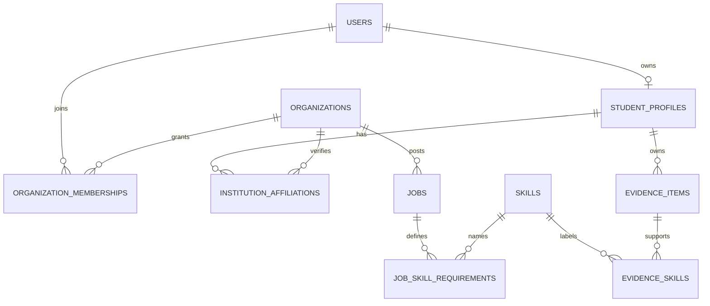

# Initial Data Model

The model supports the first student-evidence-to-job-match demo. It intentionally excludes messaging, applications, assessment attempts, and external account connections until their workflows are designed.

## Entities

- `users`: identity-provider subject, normalized email, account state, and timestamps. Passwords belong to the identity provider, not this table, if managed authentication is selected.
- `organizations`: display name, type (`company` or `institution`), verification state, and timestamps.
- `organization_memberships`: `user_id`, `organization_id`, scoped role, status, and timestamps. One active membership per user/organization/role policy should be defined; unique constraints must prevent accidental duplicate grants.
- `student_profiles`: one-to-one `user_id`, profile fields needed for the demo, `discoverable` defaulting to false, and timestamps.
- `institution_affiliations`: student profile, institution organization, status, and authorization/verification provenance. Enrollment visibility must be explicitly defined.
- `skills`: canonical skill name and optional category; define a normalization strategy before imports.
- `evidence_items`: student profile, type, source, title/summary, source reference, verification state, observed and created timestamps, and visibility. Store only data needed for the product and respect deletion/retention policy.
- `evidence_skills`: many-to-many evidence-to-skill association with a rationale and optional proficiency estimate/confidence fields kept distinct.
- `jobs`: organization owner, title, description, location/work mode, status, and publication timestamps.
- `job_skill_requirements`: job, skill, required/preferred level, and relative weight. Validate weights and requirements on the server.

The initial SQLAlchemy schema is in `backend/talent_platform/models.py`. Membership uniqueness is currently one row per user and organization; changing a role should update that row rather than create a second grant.

## Integrity and access invariants

- Foreign keys and unique constraints protect relationships; application code must still enforce authorization.
- Organization-owned rows include `organization_id` and are always scoped to an authorized organization membership.
- A student's evidence must belong to that student's profile. Do not infer ownership from a client-provided profile ID.
- Candidate discovery excludes profiles unless `discoverable` is true. Evidence visibility is checked per item, not inherited from search access.
- Verification state and source are first-class evidence attributes; imported or self-reported values must not be represented as verified.
- Record sensitive reads and administrative changes in an audit table before production launch. Define retention and erasure behavior before storing real student data.
- Any cached or persisted match result should retain the job requirement version and evidence timestamps used, so explanations can be reproduced and invalidated when data changes.

## Deferred design decisions

Confirm identity provider, email verification, organization verification, institution enrollment approval, evidence visibility choices, and privacy jurisdiction with the team before implementing real accounts or personal data.
