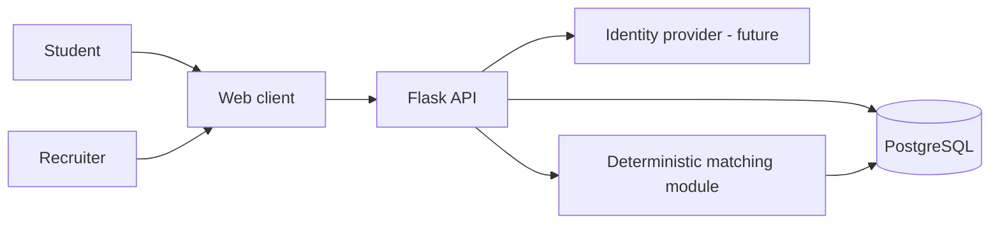

# System Design

## Goal and first demo

Build a multi-organization talent platform around verified, explainable evidence. The first demo follows one end-to-end path:

1. A student creates a profile, adds evidence, and explicitly opts into recruiter discovery.
2. A recruiter who belongs to a company creates a role with skill requirements.
3. The platform finds discoverable candidates and explains which evidence relates to each requirement.

This is a modular monolith, not a set of microservices. Authentication, assessment delivery, messaging, AI analysis, and external integrations are later milestones.

## Components

The current code contains the Flask app factory, initial SQLAlchemy models, Flask-Migrate scaffold, a liveness endpoint, and a recruiter discovery policy service. No migration revision has been generated or applied. Identity-provider integration, HTTP authentication/routes, and a frontend are not selected or implemented. The discovery service requires a trusted user ID from future server-side authentication and is not exposed through an endpoint yet.

## Tenancy and authorization

- A user is an individual account; organization access is granted only through an organization membership.
- An organization has a type (`company` or `institution`) and a verification state.
- Membership roles are scoped to one organization, for example `owner`, `recruiter`, `institution_admin`, or `faculty`.
- Every organization-owned record carries an `organization_id`. API service methods must authorize the active user's membership and role for that same organization before reading or changing it.
- Never accept a browser-supplied organization, role, or owner identifier as proof of access. Resolve it from the authenticated server-side identity and membership.
- Add tenant-isolation tests before exposing organization or candidate data.

## Student privacy and evidence

- Discovery is opt-in and can be revoked.
- Each evidence item has an owner and visibility policy. Recruiter search only returns evidence allowed by the student's current settings.
- Keep contact details and private evidence out of discovery responses. The student may choose to share them for a specific application or conversation later.
- Record evidence source, verification state, observed time, and freshness. A GitHub account or self-reported skill is not, by itself, proof of proficiency.
- Record access to sensitive candidate data and organization administrative actions in an audit trail before production use.
- Define retention, deletion, consent, and applicable student-data obligations before accepting real personal data.

## Explainable matching

Matching is deterministic for the MVP. Compare each job requirement with candidate evidence and return per-skill reasons: evidence present or missing, source, verification state, and recency. Keep evidence confidence separate from estimated proficiency. Do not collapse candidates into a universal score, use protected characteristics, or automatically reject candidates. A recruiter remains responsible for decisions, and the explanation must be available with the result.

## Initial API boundary

All application endpoints will be versioned under `/v1` once implemented:

- `GET/PATCH /v1/me/profile`: the signed-in student's own profile.
- `GET/POST /v1/me/evidence`: the student's evidence items and visibility.
- `POST /v1/organizations`: create an organization subject to verification policy.
- `/v1/organizations/{organization_id}/members`: manage organization membership with owner/admin checks.
- `POST /v1/jobs`: create a job for an authorized recruiter organization.
- `GET /v1/jobs/{job_id}/matches`: discover opted-in candidates and per-requirement explanations.
- `GET /v1/candidates/{candidate_id}`: return only fields and evidence permitted for the current viewer.

These are design targets, not routes implemented in the starter.

## Incremental delivery

1. Review this design and the data model with the team; confirm jurisdiction, demo timeline, and identity provider.
2. Add models and migrations for organizations, memberships, student profiles, skills, evidence, jobs, and requirements.
3. Implement authentication integration and server-side authorization before adding real personal data.
4. Add opt-in profile visibility and tenant/privacy tests.
5. Implement deterministic matching with explanations and fixtures.
6. Add a small UI for the demo flow; only then consider applications, assessments, GitHub, analytics, or AI.
